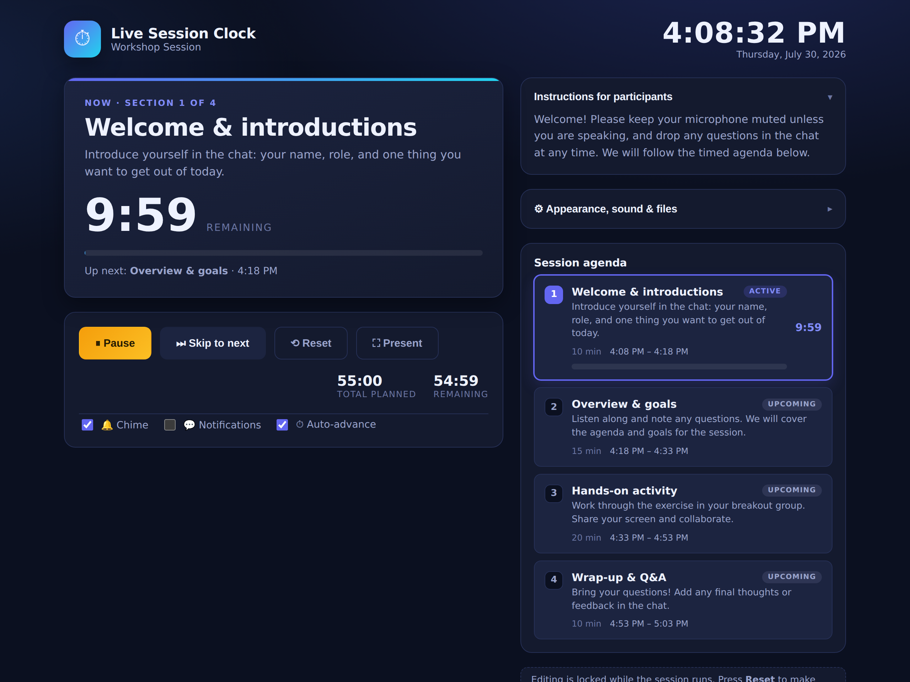
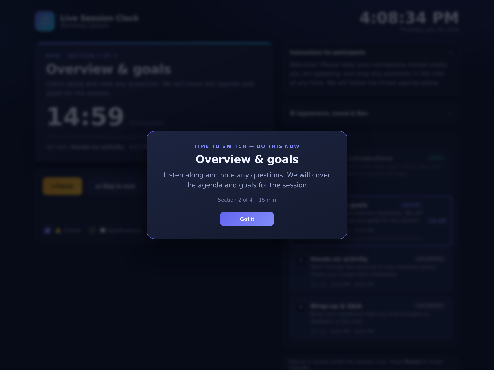
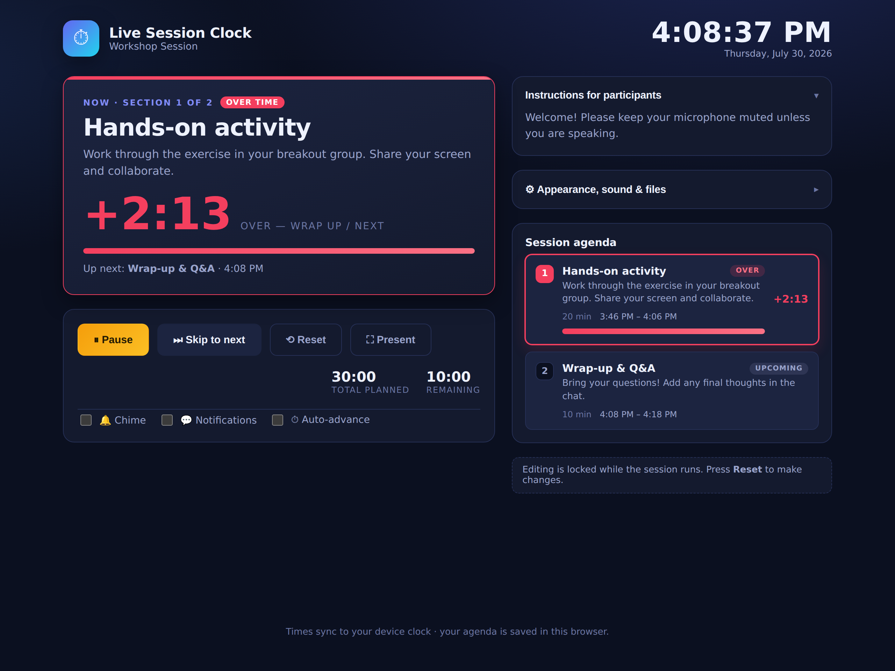
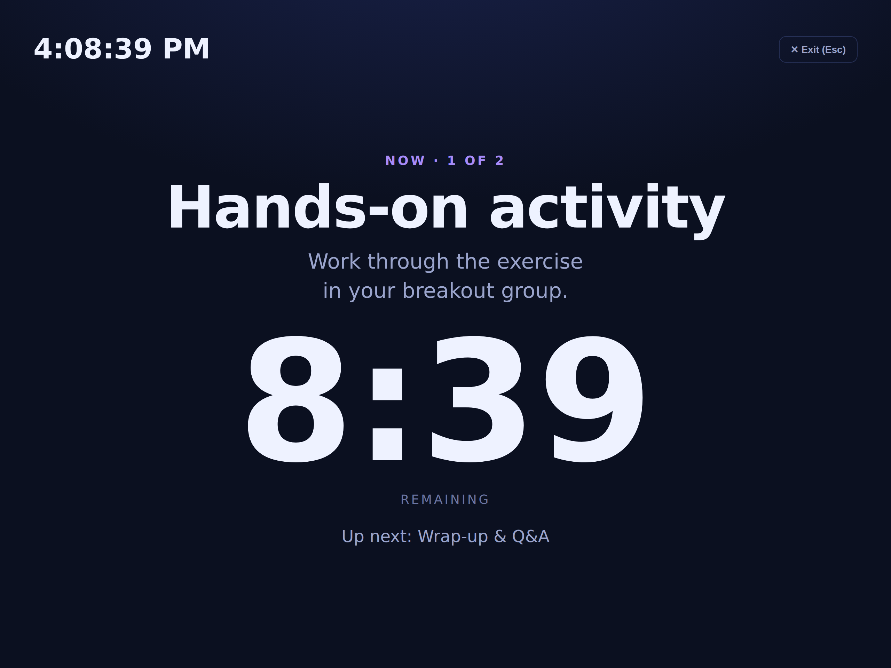
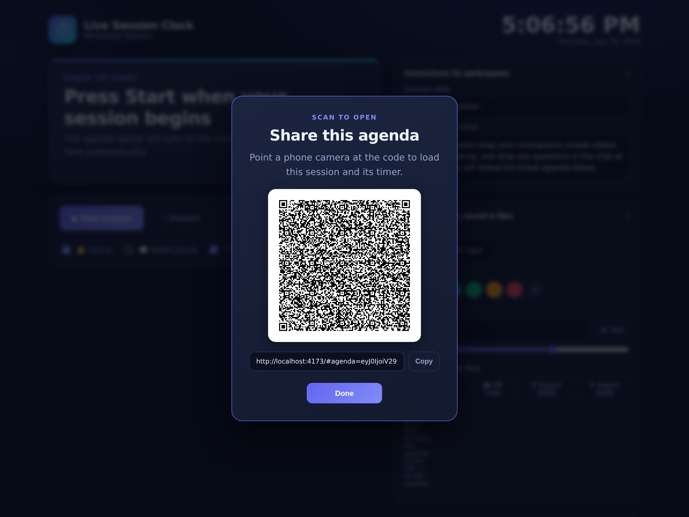

# ⏱ Live Session Clock

[](https://coolmukky.github.io/live-session-clock/)
[](https://github.com/coolmukky/live-session-clock/actions/workflows/deploy.yml)

A live clock and **session-timer tool for facilitators, trainers, and hosts**.
Build a timed agenda, sync it to the real wall clock, and let the app tell your
audience exactly **what they should be doing right now** — with pop-up reminders
when each section begins.

Great for workshops, webinars, classes, standups, hackathons, exams, and any
run-of-show that needs to stay on time.

**▶ Try it live: [coolmukky.github.io/live-session-clock](https://coolmukky.github.io/live-session-clock/)**



> When each section begins, a pop-up announces it to the audience (with an optional chime and browser notification):
>
> 

## ✨ Features

- **Live clock** — a big, always-on wall clock so everyone shares the same time.
- **Instructions for participants** — a free-text panel for house rules, links,
  or a welcome message. Editable before you start, then locked on screen.
- **Session breakdown with per-section timers** — build an agenda of sections,
  each with its own duration and a "what to do now" activity note.
- **Add / edit / reorder sections** — set how long each one is; the schedule
  recalculates instantly.
- **Synced to the clock** — press **Start** and every section is anchored to the
  real time, showing exact start/end times and a live countdown per section.
- **Reminder pop-ups** — when a section becomes active, a full-screen reminder
  announces it to the audience, with an optional **chime** and **browser
  notification**, so nobody misses the switch.
- **Overrun handling** — when a section runs long it turns **red** and counts up
  (`+M:SS` "over time") instead of silently moving on. Hit **Skip to next** to
  advance whenever you're ready.
- **Auto-advance toggle** — keep a strict clock-driven schedule (sections roll
  over automatically at their planned end), or turn it off to hold-and-overrun.
- **Fullscreen presenter mode** — a giant projector-friendly view (current
  activity + huge countdown + clock) for the room, one click away (`Esc` exits).
- **Sound choices** — pick from several chimes with a volume slider and a test
  button.
- **Theming** — light / dark mode plus a set of accent colors (or a custom
  color) so it matches your event's look.
- **Import / export agendas (JSON)** — save a run-of-show to a file and reload
  or share it later.
- **Shareable link** — "Copy share link" encodes the whole agenda into a URL,
  so you can drop it in a calendar invite and it loads with no file needed.
- **QR code** — turn that link into a QR that attendees can scan (off a
  projected screen or the presenter view) to open the session and its timer on
  their own phones.
- **Installable & offline (PWA)** — install it as an app on desktop or mobile;
  a service worker caches it so it keeps working with no network (great for
  kiosks and room screens).
- **Pause / resume / reset**, total and remaining time, and a warning state in
  the final 30 seconds of each section.
- **Keyboard shortcuts** — <kbd>Space</kbd> pause/resume (or start),
  <kbd>→</kbd> skip to next, <kbd>P</kbd> presenter view.
- **Stays awake & always in view** — a Screen Wake Lock keeps the display on
  while running, and the current countdown shows in the **browser tab title**.
- **Accessible** — the reminder pop-up traps and restores focus, section
  changes are announced to screen readers, and animations respect
  `prefers-reduced-motion`.
- **Auto-saved & refresh-safe** — your agenda and a running session are stored
  in the browser, so a reload picks up right where you left off. A built-in
  error boundary keeps a stray bug from taking the whole session down.

No accounts, no backend — it's a static site that runs entirely in the browser.

### Overrun, presenter & share-by-QR

| A section running over its planned time | Fullscreen presenter view | Scan-to-open QR of the agenda |
| :---: | :---: | :---: |
|  |  |  |

## 🚀 Getting started

**Prerequisites:** [Node.js](https://nodejs.org/) 18+

```bash
npm install     # install dependencies
npm run dev     # start the dev server (http://localhost:5173)
npm test        # run the unit tests (Vitest)
npm run build   # type-check and build to dist/
npm run preview # preview the production build
```

### Tests

Unit tests cover the pure timing engine (`computeSnapshot` — overrun math,
projections, remaining time), agenda import validation, and share-link
encode/decode. Run them with `npm test`; they also run in CI on every push
before the site is deployed.

### Install as an app / offline

It's a PWA: open the live site and use your browser's **Install** option
(desktop) or **Add to Home Screen** (mobile). Once loaded, a service worker
caches the app so it runs offline — handy for a room screen with flaky Wi-Fi.

## 🖥️ How to use

1. **Set up** (before starting): edit the session title and participant
   instructions, then add your sections — each with a name, a length in minutes,
   and a note describing what participants should be doing. Open **Appearance,
   sound & files** to pick a theme/accent, choose a chime, or import a saved
   agenda.
2. **Start**: press **Start session**. The agenda locks and syncs to the clock;
   the hero panel shows the current section and a countdown.
3. **Run**: as each section begins, a reminder pop-up appears (with an optional
   chime/notification). **Pause/Resume** as needed; **Skip to next** to move on
   early or once a section is over; **Present** for the fullscreen room view.
   Keyboard: <kbd>Space</kbd> pause/resume, <kbd>→</kbd> next, <kbd>P</kbd>
   present.
4. **Finish**: when the last section ends you'll get a "session complete"
   pop-up. **Reset** to run it again or make edits.

**Auto-advance** (in the controls bar) is on by default — sections roll over at
their planned end for a strict schedule. Turn it off if you'd rather each
section wait for you and show overrun until you press **Skip to next**.

Toggle the **chime**, **browser notifications**, and **auto-advance** from the
controls bar. (Notifications ask for permission the first time and work best
when the tab is in the background.)

## 🌐 Deploying

The Vite `base` is `./` (relative), so the same build runs at a domain root or
a sub-path — any static host works. Build command: `npm run build`, output
directory: `dist`.

**GitHub Pages (live — [coolmukky.github.io/live-session-clock](https://coolmukky.github.io/live-session-clock/)):**
a GitHub Actions workflow
([`.github/workflows/deploy.yml`](.github/workflows/deploy.yml)) runs the tests
and publishes on every push to `main`. Enable it under **Settings → Pages →
Source → GitHub Actions**.

**Netlify / Vercel / Cloudflare Pages (for a username-free subdomain):** import
the repo and deploy — [`netlify.toml`](netlify.toml),
[`.node-version`](.node-version), and [`public/_headers`](public/_headers) are
included, so it's zero-config (build `npm run build`, output `dist`). These give
a URL like `live-session-clock.netlify.app`.

## 🛠️ Tech

- [React 19](https://react.dev/) + [TypeScript](https://www.typescriptlang.org/)
- [Vite](https://vitejs.dev/) for dev/build, [Vitest](https://vitest.dev/) for tests
- Only one small runtime dependency beyond React —
  [`qrcode-generator`](https://www.npmjs.com/package/qrcode-generator) for the
  QR code. Timers, chimes, offline caching, and notifications use the Web
  Audio, Service Worker, and Notifications APIs directly.

## 📁 Project structure

```
src/
  App.tsx                 # orchestrates state, run controls, reminders, theming
  engine.ts               # pure computeSnapshot() — the testable timing core
  types.ts                # shared types
  defaultSession.ts       # sample agenda shown on first load
  *.test.ts               # Vitest unit tests (engine, sessionIO, share)
  hooks/
    useNow.ts             # single ticking clock source
    useLocalStorage.ts    # persistence + cross-tab sync
    useSessionEngine.ts   # derives the live timeline (incl. overrun) from state
    useWakeLock.ts        # keeps the screen awake while running
  components/
    Clock.tsx             # live wall clock
    ErrorBoundary.tsx     # crash fallback with reload / clear-data
    CurrentActivity.tsx   # hero: what to do now + countdown / overrun
    Agenda.tsx            # section list, add/edit/reorder
    SectionForm.tsx       # add/edit a section
    InstructionsPanel.tsx # participant instructions
    Controls.tsx          # start/pause/resume/skip/reset + present + toggles
    SettingsPanel.tsx     # theme, accent, chime, volume, share/import/export
    PresenterView.tsx     # fullscreen big-screen room view (+ share QR)
    ReminderModal.tsx     # the pop-up announcement
    QrCode.tsx            # QR matrix -> single-path SVG
    QrModal.tsx           # scan-to-open share dialog
  utils/
    time.ts               # formatting helpers
    alerts.ts             # chimes + browser notifications
    theme.ts              # accent presets + light/dark application
    sessionIO.ts          # agenda import/export + validation
    share.ts              # encode/decode an agenda into a shareable URL
    qr.ts                 # QR encoding (matrix + compact SVG path)

public/
  manifest.webmanifest    # PWA manifest
  sw.js                   # service worker (offline caching)
  icon-*.png              # app icons
```

## 📄 License

[MIT](LICENSE)
